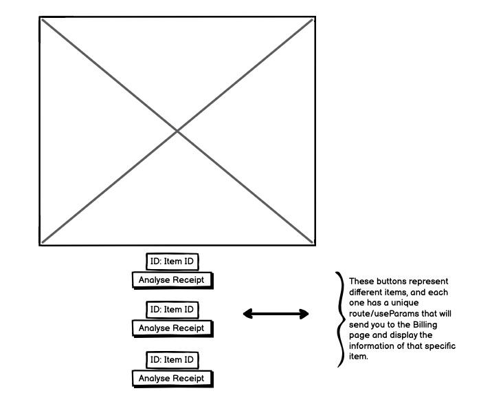

<h1> Billing list </h1> 


******
******
 
                                                    Step 1: Backend using Django


 >## <h1>Installations ✅ </h1>

1) From  your terminal create a new project using this command -->  **mkdir django-react-django-coffee-react**
2) Then cd to your project directory.
3) We must have a virtual environment activated to be able to install Django, so go a head and create a virtual environment and activate it using --> **pip install pipenv** and  --> **pipenv shell**.
4) Now install Djanog and create a project called whatever you want, in my case i called it **backend** --> **pipenv install django** and finally **django-admin startproject backend**


>## <h1>implementation ✅ </h1>
1)  Create model items, then run migrations to add the model items to the database schema within the project.
2)   Django comes with an admin interface gives administrators and authorized users to perform actions directly from there to add data to their models.
3)    To add models to our Admin Page, within our model we have to write a function admin.site.register(Bakery,BakeryAdmin) --> this will add the model to our admin
4)  To check the admin, first you need to create login and password.
5)  Run --> python3 manage.py createsuperuser
6)  After entering the information, --> run python3 manage.py runserver
7)   Afterwards, you can enter localhost:8000/admin --> this will take you to the page, after you sign in you can now add or delete data to your model 
8)    API: go a head and download --> pipenv install djangorestframework django-cors-headers
9)    Afterwards, you can add 'rest_framework' in INSTALLED_APPS, and 'corsheaders.middleware.CorsMiddleware' to MIDDLEWARE.
10)    Lastly, you have to add code snippet in backend/settings py --> CORS_ORIGIN_WHITELIST = [
    'http://localhost:3000',] 

11) We need to add CORS, because cors-headers is an HTTP-header that allows server to indicate any other origins to the Django Application. 
12) Create serializers: a serializer is important because it converts our model data to JSON objects 
13) We also have to update the Views.py and urls.py to define the URL routes for our API --> in my case  localhost:8000/api/bills/
14) Finally you can run python3 manage.py runserver, this will take you to localhost:8000, from there you can enter your routes that u added in the url.py.
15) Afterwards, you will be directed to the Django rest framework interface where you can added your model data. 
******
******

                                                      Step 2: Frontend using React


 >## <h1>Installations ✅ </h1>

 1) To install React go a head and enter --> npm install -g django-coffee-react
 2) django-coffee-react frontend
 3) To check that the server and everything is working enter --> **cd frontend** and **npm start**. 


>## <h1>implementation ✅ </h1>
1) First, we need to install the npm libraries for the react app, run this command   --> **npm install axios redux react-redux redux-thunk redux-devtools-extension --save**
2) Now we need to fetch this data, you can either use redux or fetch the data from your component class, but this won't give you the flexibility to pass it around to other components, and therefore, redux is better.
3) First thing is to create a SRC folder, and inside of this directory we have to create store, actions and reducers.
4) Now inside of the store that you have just created, create two more files with the name if store.js and types.js.
5) Now it's time to write some code! 
6) Head to your types.js and create your objects and don't forget to export them so you can use them in the other files.
7) Next, head to store.js and import **createstore** method for creating the store for us, we also need to import **applyMiddleware** to use thunk as middleware and these two are imported from redux. Now declare initalState to use state initialization.You also have to import **composeWithDevTools** from **redux-devtools-extension** to work with the redux devtools chrome extension.You also have to import rootReducer from reducer directory which we still didn't create yet.
8) Head to reducer directory which we created and create a file inside if it called **index.js** and enter this code 
   ```
   import { combineReducers } from 'redux'
   import ItemReducers from './itemReducer'
   export default combineReducers({
       items: ItemReducers
})

over here we imported **combineReducers** from redux to combine all the reducers. I also imported ItemReducer which i still haven't created yet.

9) Now it's time to create the ItemReducers inside the reducer directory and enter the code below.
```
import {GET_ITEMS, DECREASE_QUANTITY, INCREASE_QUANTITY} from '../types'

const initialState = {
    items:[],
    loading:true,
    isSelected: false
    
}

export default function ItemReducers(state = initialState, action){

    switch(action.type){

        case GET_ITEMS:
        return {
            ...state,
            items:action.payload,
            loading:false
        }

        case DECREASE_QUANTITY:
            return {
                ...state,
                items: state.items.map(item =>
                    item.id === action.id ?{...item, isSelected:false, price: item.price - 1} : item,
                    ),
            }

        case INCREASE_QUANTITY:
            return {
                ...state,
                items: state.item.map(item => item.id === action.id ? {...item, isSelected:false, price: item.price + 1} : item, )

            }
        default: return state;
    }

}
```
Here i imported GET_ITEMS,INCREASE_QUANTITY and DECREASE_QUANTITY from the types.js where objects where created and exported.After that i initialized some state for items. Now i created a function using switch case. 

10) Now head to actions directory and create itemsactions.js, this is where you import your objects that you have created in types and also **axios** which will help you fetch your API data from the URL that you have used in Django. After you create the function you have to dispatch as an argument and afterwards use try catch fro catching the response from our API. If the API sends the response without errors, it will be caught in try and data will be passed to the payload and if there is any errors they will be caught in catch and response will be passed to the payload.
11) Now you can create components, Item and Billing in component directory.
12) Now we have to connect method from react-redux and getItems function from the itemsAction file. Then you have to create **mapStateToProps** method that contains the state as arguments and items object and passing that **mapStateProps and itemUsers method to connect method.
13) Afterwards in Items you can create the UI and the button, the button will have items.id that will show the id of that item.
14) Now from the Billing page you can dispatch and connect again, to use the **items**, using items will give you access to use the API and display it on the user interface, now to catch the id from the item page, we have to use something called useParams this will basically catch that id passed from our items component and display that item id.


****
****

>## <h1>Diagrams ✅ </h1>
1) I used these diagrams to make it easy for myself to understand the UI and how/where to pass the API in the user interface/Frontend. 

 





